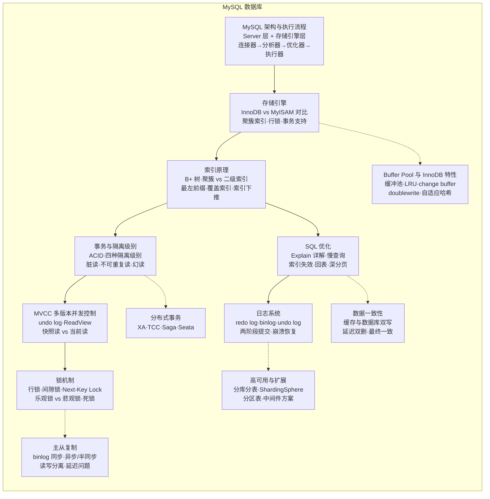

```mermaid
flowchart TB
    subgraph MySQL["MySQL 数据库"]
        direction TB
        M0["MySQL 架构与执行流程<br/>Server 层 + 存储引擎层<br/>连接器→分析器→优化器→执行器"] --> M1["存储引擎<br/>InnoDB vs MyISAM 对比<br/>聚簇索引·行锁·事务支持"]
        M1 --> M2["索引原理<br/>B+ 树·聚簇 vs 二级索引<br/>最左前缀·覆盖索引·索引下推"]
        M2 --> M3["事务与隔离级别<br/>ACID·四种隔离级别<br/>脏读·不可重复读·幻读"]
        M3 --> M4["MVCC 多版本并发控制<br/>undo log·ReadView<br/>快照读 vs 当前读"]
        M4 --> M5["锁机制<br/>行锁·间隙锁·Next-Key Lock<br/>乐观锁 vs 悲观锁·死锁"]
        M2 --> M6["SQL 优化<br/>Explain 详解·慢查询<br/>索引失效·回表·深分页"]
        M6 --> M7["日志系统<br/>redo log·binlog·undo log<br/>两阶段提交·崩溃恢复"]
        M1 -.-> M1_1["Buffer Pool 与 InnoDB 特性<br/>缓冲池·LRU·change buffer<br/>doublewrite·自适应哈希"]
        M5 -.-> M8["主从复制<br/>binlog 同步·异步/半同步<br/>读写分离·延迟问题"]
        M7 -.-> M9["高可用与扩展<br/>分库分表·ShardingSphere<br/>分区表·中间件方案"]
        M3 -.-> M10["分布式事务<br/>XA·TCC·Saga·Seata"]
        M6 -.-> M11["数据一致性<br/>缓存与数据库双写<br/>延迟双删·最终一致"]
    end
```
