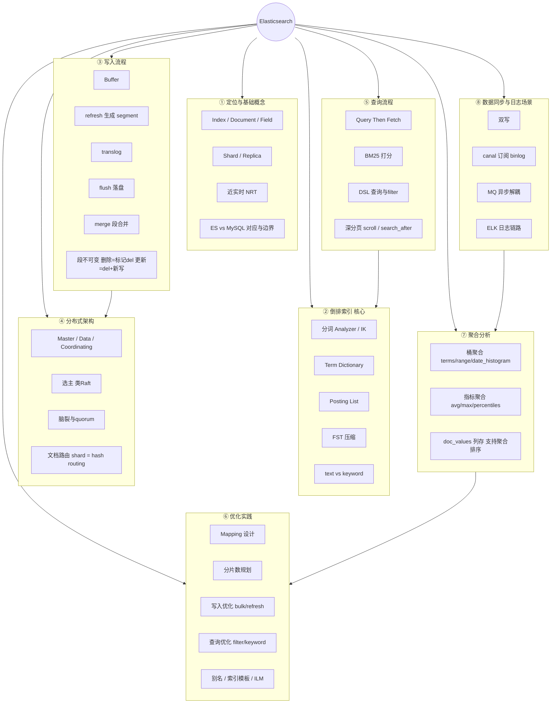

```mermaid
flowchart TD
    E(("Elasticsearch"))

    subgraph BASE["① 定位与基础概念"]
        B1["Index / Document / Field"]
        B2["Shard / Replica"]
        B3["近实时 NRT"]
        B4["ES vs MySQL 对应与边界"]
    end

    subgraph INV["② 倒排索引 核心"]
        I1["分词 Analyzer / IK"]
        I2["Term Dictionary"]
        I3["Posting List"]
        I4["FST 压缩"]
        I5["text vs keyword"]
    end

    subgraph WRITE["③ 写入流程"]
        W1["Buffer"]
        W2["refresh 生成 segment"]
        W3["translog"]
        W4["flush 落盘"]
        W5["merge 段合并"]
        W6["段不可变 删除=标记del 更新=del+新写"]
    end

    subgraph DIST["④ 分布式架构"]
        D1["Master / Data / Coordinating"]
        D2["选主 类Raft"]
        D3["脑裂与quorum"]
        D4["文档路由 shard = hash routing"]
    end

    subgraph QUERY["⑤ 查询流程"]
        Q1["Query Then Fetch"]
        Q2["BM25 打分"]
        Q3["DSL 查询与filter"]
        Q4["深分页 scroll / search_after"]
    end

    subgraph AGG["⑦ 聚合分析"]
        G1["桶聚合 terms/range/date_histogram"]
        G2["指标聚合 avg/max/percentiles"]
        G3["doc_values 列存 支持聚合排序"]
    end

    subgraph SYNC["⑧ 数据同步与日志场景"]
        Y1["双写"]
        Y2["canal 订阅 binlog"]
        Y3["MQ 异步解耦"]
        Y4["ELK 日志链路"]
    end

    subgraph OPT["⑥ 优化实践"]
        O1["Mapping 设计"]
        O2["分片数规划"]
        O3["写入优化 bulk/refresh"]
        O4["查询优化 filter/keyword"]
        O5["别名 / 索引模板 / ILM"]
    end

    E --> BASE
    E --> INV
    E --> WRITE
    E --> DIST
    E --> QUERY
    E --> AGG
    E --> SYNC
    E --> OPT
    WRITE --> DIST
    QUERY --> INV
    AGG --> OPT
    SYNC --> AGG
```
