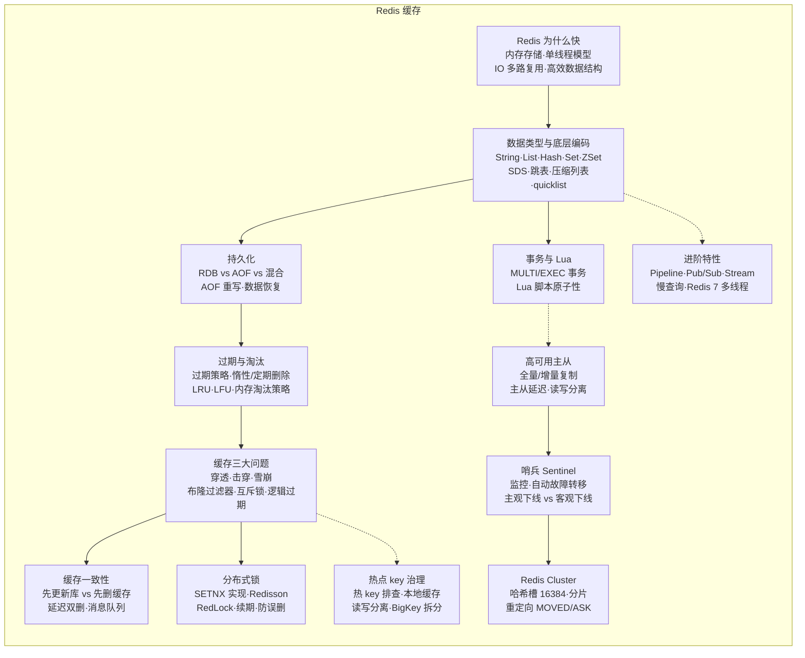

```mermaid
flowchart TB
    subgraph Redis["Redis 缓存"]
        direction TB
        R0["Redis 为什么快<br/>内存存储·单线程模型<br/>IO 多路复用·高效数据结构"] --> R1["数据类型与底层编码<br/>String·List·Hash·Set·ZSet<br/>SDS·跳表·压缩列表·quicklist"]
        R1 --> R2["持久化<br/>RDB vs AOF vs 混合<br/>AOF 重写·数据恢复"]
        R2 --> R3["过期与淘汰<br/>过期策略·惰性/定期删除<br/>LRU·LFU·内存淘汰策略"]
        R3 --> R4["缓存三大问题<br/>穿透·击穿·雪崩<br/>布隆过滤器·互斥锁·逻辑过期"]
        R4 --> R5["缓存一致性<br/>先更新库 vs 先删缓存<br/>延迟双删·消息队列"]
        R4 --> R6["分布式锁<br/>SETNX 实现·Redisson<br/>RedLock·续期·防误删"]
        R1 --> R7["事务与 Lua<br/>MULTI/EXEC 事务<br/>Lua 脚本原子性"]
        R7 -.-> R8["高可用主从<br/>全量/增量复制<br/>主从延迟·读写分离"]
        R8 --> R9["哨兵 Sentinel<br/>监控·自动故障转移<br/>主观下线 vs 客观下线"]
        R9 --> R10["Redis Cluster<br/>哈希槽 16384·分片<br/>重定向 MOVED/ASK"]
        R4 -.-> R11["热点 key 治理<br/>热 key 排查·本地缓存<br/>读写分离·BigKey 拆分"]
        R1 -.-> R12["进阶特性<br/>Pipeline·Pub/Sub·Stream<br/>慢查询·Redis 7 多线程"]
    end
```
